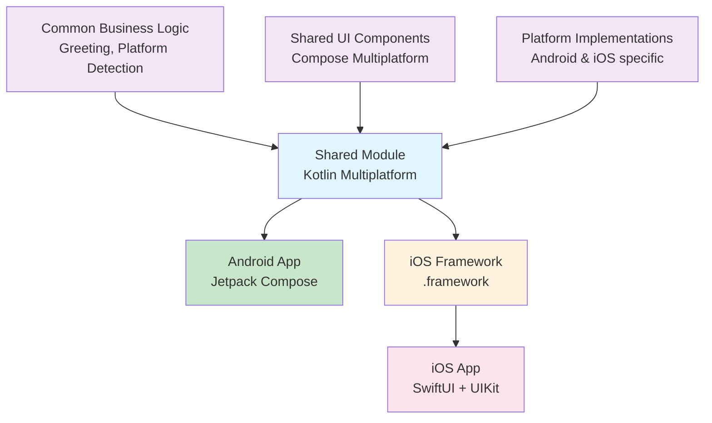

# 🚀 FirstKmpApp - Kotlin Multiplatform Mobile

A modern **Kotlin Multiplatform Mobile (KMM)** application demonstrating shared business logic and UI between Android and iOS platforms using **Compose Multiplatform**.

[](https://kotlinlang.org)
[](https://www.jetbrains.com/lp/compose-multiplatform/)
[](https://android.com)
[](https://developer.apple.com/ios/)

## 📱 Features

- ✅ **Shared Business Logic** - Common code for both platforms
- ✅ **Compose Multiplatform UI** - Shared UI components across platforms  
- ✅ **Platform Detection** - Shows platform-specific information
- ✅ **Material 3 Design** - Modern Material Design components
- ✅ **Date/Time Operations** - Using kotlinx-datetime library
- ✅ **Native Performance** - Compiles to native code on both platforms

## 🏗️ Architecture

### **Project Structure**

```
FirstKmpApp/
├── shared/                          # 🔄 Shared Kotlin Multiplatform Module
│   ├── src/
│   │   ├── commonMain/kotlin/       # 📦 Platform-agnostic code
│   │   │   ├── Greeting.kt          # Business logic
│   │   │   └── ui/ComposeTestApp.kt # Shared UI components
│   │   ├── androidMain/kotlin/      # 🤖 Android-specific implementations
│   │   │   └── Platform.android.kt
│   │   └── iosMain/kotlin/          # 🍎 iOS-specific implementations
│   │       ├── Platform.ios.kt
│   │       └── MainViewController.kt
│   └── build.gradle.kts
├── androidAppKMP/                   # 🤖 Android Application
│   ├── src/main/kotlin/
│   │   └── MainActivity.kt
│   └── build.gradle.kts
├── iosAppKMP/                       # 🍎 iOS Application  
│   ├── iosAppKMP/
│   │   ├── ContentView.swift
│   │   └── iOSApp.swift
│   └── iosAppKMP.xcodeproj
└── gradle/libs.versions.toml        # 📋 Version Catalog
```

### **🔄 Multiplatform Architecture**



### **📦 Technology Stack**

| Component | Technology | Version |
|-----------|------------|---------|
| **Language** | Kotlin | 2.1.21 |
| **UI Framework** | Compose Multiplatform | 1.8.2 |
| **Android UI** | Jetpack Compose | Material 3 |
| **iOS UI** | SwiftUI + Compose Multiplatform | Native |
| **Date/Time** | kotlinx-datetime | 0.6.2 |
| **Build System** | Gradle | 8.11.1 |
| **iOS Integration** | Xcode | 16.4+ |

## 🛠️ Setup & Installation

### **Prerequisites**

- **macOS** (for iOS development)
- **Android Studio** Arctic Fox or newer
- **Xcode** 16.4 or newer
- **JDK** 17 or newer
- **Kotlin** 2.1.21

### **🔧 Getting Started**

1. **Clone the repository**
   ```bash
   git clone https://github.com/yourusername/FirstKmpApp.git
   cd FirstKmpApp
   ```

2. **Open in Android Studio**
   - Open Android Studio
   - Select "Open an existing project"
   - Navigate to the cloned directory

3. **Sync Gradle**
   ```bash
   ./gradlew build
   ```

## 🚀 Running the Application

### **🤖 Android**

#### Option 1: Android Studio
1. Open the project in Android Studio
2. Select `androidAppKMP` configuration
3. Click **Run** ▶️ or press `Ctrl+R`

#### Option 2: Command Line
```bash
# Build and install on connected device/emulator
./gradlew :androidAppKMP:installDebug

# Or use the provided script
./run_android.sh
```

### **🍎 iOS**

#### Option 1: Automated Script
```bash
# Build framework and open Xcode
./run_ios.sh
```

#### Option 2: Manual Process
1. **Build the shared framework**
   ```bash
   ./gradlew :shared:linkDebugFrameworkIosSimulatorArm64
   ```

2. **Open Xcode project**
   ```bash
   open iosAppKMP/iosAppKMP.xcodeproj
   ```

3. **Run in Xcode**
   - Select iPhone simulator
   - Press `Cmd+R` or click ▶️

## 📱 Expected Output

Both Android and iOS apps will display:

```
✨ Compose Multiplatform 1.8.2
Hello, [Platform] [Version] KMP !
🎯 Testing iOS 18.5 compatibility
```

**Examples:**
- **Android**: "Hello, Android 34 KMP !"
- **iOS**: "Hello, iOS 18.5 KMP !"

## 🏛️ Architecture Deep Dive

### **🔄 Shared Module (`shared/`)**

#### **Common Main (`commonMain/`)**
- **Platform-agnostic code** that runs on all targets
- **Business logic** (Greeting class)
- **Shared UI components** (Compose Multiplatform)
- **Data models** and utilities

#### **Platform-Specific (`androidMain/`, `iosMain/`)**
- **Platform implementations** of expect/actual functions
- **Platform-specific APIs** access
- **Native integrations**

#### **Key Classes:**

```kotlin
// Common business logic
class Greeting {
    fun greet(): String = "Hello, ${getPlatform().name} KMP !"
}

// Platform interface
interface Platform {
    val name: String
}

// Expect/Actual pattern
expect fun getPlatform(): Platform
```

### **🤖 Android App (`androidAppKMP/`)**

- **Jetpack Compose** for modern Android UI
- **Material 3** design system
- **Activity-based** architecture
- **Direct integration** with shared module

```kotlin
class MainActivity : ComponentActivity() {
    override fun onCreate(savedInstanceState: Bundle?) {
        super.onCreate(savedInstanceState)
        setContent {
            ComposeTestApp() // Shared Compose UI
        }
    }
}
```

### **🍎 iOS App (`iosAppKMP/`)**

- **SwiftUI** as the main UI framework
- **UIViewControllerRepresentable** bridge to Compose
- **Native iOS** look and feel
- **Framework integration** via CocoaPods/SPM

```swift
struct ComposeView: UIViewControllerRepresentable {
    func makeUIViewController(context: Context) -> UIViewController {
        MainViewControllerKt.MainViewController()
    }
}
```

## 🔧 Development Workflow

### **🛠️ Build Scripts**

| Script | Purpose |
|--------|---------|
| `./run_android.sh` | Build and install Android app |
| `./run_ios.sh` | Build iOS framework and open Xcode |
| `./test_both_platforms.sh` | Test compilation on both platforms |

### **📱 Adding New Features**

1. **Add business logic** in `shared/src/commonMain/`
2. **Add platform-specific implementations** in respective `Main/` folders
3. **Update UI** in `shared/src/commonMain/kotlin/ui/`
4. **Test on both platforms**

### **🧪 Testing Strategy**

```bash
# Test shared module
./gradlew :shared:test

# Test Android
./gradlew :androidAppKMP:test

# Build both platforms
./gradlew build
```

## 📚 Key Concepts

### **🔄 Expect/Actual Pattern**
- **Expect**: Declaration in common code
- **Actual**: Platform-specific implementation

### **🎨 Compose Multiplatform**
- **Shared UI** across platforms
- **Platform-adaptive** components
- **Native performance**

### **📦 Version Catalog**
- **Centralized** dependency management
- **Type-safe** dependency references
- **Consistent versions** across modules

## 🤝 Contributing

1. **Fork** the repository
2. **Create** a feature branch (`git checkout -b feature/amazing-feature`)
3. **Commit** your changes (`git commit -m 'Add amazing feature'`)
4. **Push** to the branch (`git push origin feature/amazing-feature`)
5. **Open** a Pull Request

## 📄 License

This project is licensed under the MIT License - see the [LICENSE](LICENSE) file for details.

## 🙋‍♂️ Support

- **Issues**: [GitHub Issues](https://github.com/yourusername/FirstKmpApp/issues)
- **Discussions**: [GitHub Discussions](https://github.com/yourusername/FirstKmpApp/discussions)
- **Documentation**: [Kotlin Multiplatform Docs](https://kotlinlang.org/docs/multiplatform.html)

## 🌟 Acknowledgments

- **JetBrains** for Kotlin Multiplatform
- **Google** for Jetpack Compose
- **Apple** for SwiftUI integration
- **Kotlin Community** for excellent documentation

---

**Built with ❤️ using Kotlin Multiplatform** 